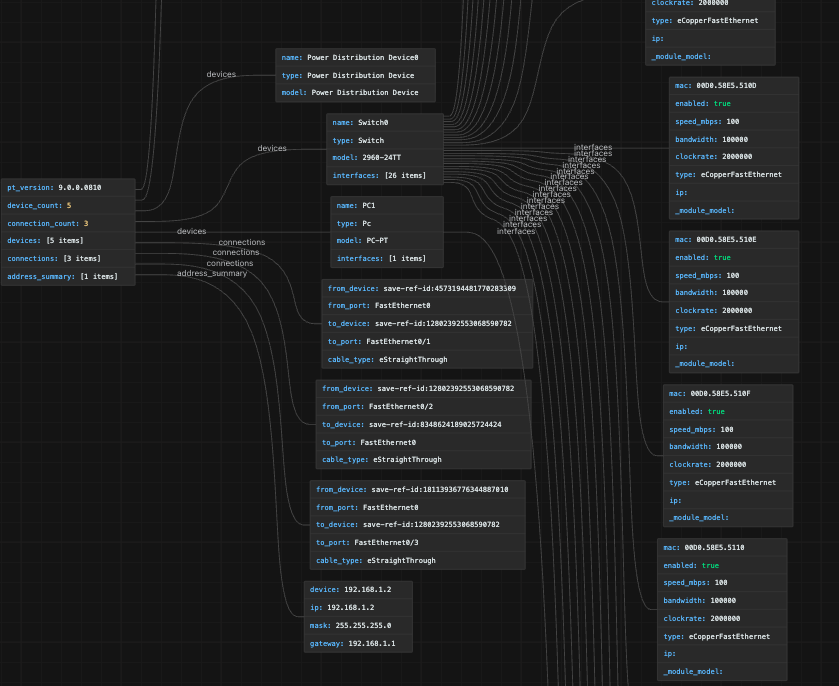

# PKT to XML Converter

[](https://opensource.org/licenses/MIT)

Convert Cisco Packet Tracer files (`.pkt` / `.pka`) to XML and back. Supports Packet Tracer 7.x, 8.x, and 9.x.

---

## Installation

**macOS**
```bash
brew install cryptopp re2
./build.sh
```

**Linux (Ubuntu/Debian)**
```bash
sudo apt-get install build-essential g++ libcryptopp-dev libre2-dev zlib1g-dev
./build.sh
```

---

## Usage

### pka2xml — convert PKT ↔ XML

```bash
# Decrypt .pkt to XML
./pka2xml -d input.pkt output.xml

# Encrypt XML back to .pkt
./pka2xml -e input.xml output.pkt

# Fix cross-version compatibility
./pka2xml -f input.pkt output.pkt
```

### pkt-summary.py — inspect without opening Packet Tracer

Three output modes, all accepting `.pkt`, `.pka`, or a pre-decoded `.xml`:

| Mode | Flag | Output | Size vs full XML |
|------|------|--------|-----------------|
| JSON summary | `--json` (default) | devices, IPs, cables, IOS config | ~100–2000x smaller |
| Lean XML | `--xml` (or `--strip`) | full XML minus UI state / animations | ~10x smaller |
| Both formats | `--xml --json` | Both JSON and Lean XML files | dependent |

```bash
# JSON summary (stdout)
python3 pkt-summary.py examples/example.pkt

# Lean XML saved to file
python3 pkt-summary.py examples/example.pkt --xml -o slim.xml

# Output both JSON and Lean XML to files (-o specifies the base name)
python3 pkt-summary.py examples/example.pkt --xml --json -o mynetwork
```

**When to use each tool:**

| `pka2xml -d` | `pkt-summary.py` |
|---|---|
| Need to edit XML and re-encrypt | Only reading / inspecting the topology |
| Need every field, including binary blobs | Need devices, IPs, cables, IOS config |

---

## Output examples

**JSON summary**
```bash
python3 pkt-summary.py examples/example.pkt
```
```json
{
  "file": "example.pkt",
  "version": "9.0.0.0810",
  "counts": { "Router": 2, "Switch": 3, "Pc": 5 },
  "devices": [
    {
      "name": "Router0",
      "type": "Router",
      "model": "1841",
      "interfaces": [
        { "name": "FastEthernet0/0", "ip": "192.168.1.1", "mask": "255.255.255.0", "status": "up" },
        { "name": "FastEthernet0/1", "ip": "10.0.0.1",    "mask": "255.255.255.252" }
      ],
      "config_preview": [
        "hostname Router0",
        "interface FastEthernet0/0",
        " ip address 192.168.1.1 255.255.255.0",
        " no shutdown"
      ]
    }
  ],
  "cables": [
    { "from": "Router0/FastEthernet0/0", "to": "Switch0/FastEthernet0/1", "type": "Straight-Through" }
  ]
}
```

**Save to file** — prints size reduction ratio:
```bash
# JSON summary output (default)
python3 pkt-summary.py examples/example.pkt  -o summary.json
# Note: The -o flag explicitly defines the output path but does not change the format.
# If you run `python3 pkt-summary.py examples/example.pkt -o topo.xml` without `--xml`,
# it will still generate a JSON file, saving it under the name `topo.xml`.

# Lean XML output
python3 pkt-summary.py examples/example.pkt --xml -o slim.xml

# Output both JSON and Lean XML
python3 pkt-summary.py examples/example.pkt --xml --json -o mynetwork
```


## Topology Visualization

Because the `pkt-summary.py` output is a standard and structured JSON file, you can easily visualize your entire network topology using existing external JSON node visualization tools (such as [JSON Crack](https://jsoncrack.com)).

Simply drop your generated `.json` summary into one of these tools to get an instant, interactive graph of your devices, properties, and connections!




## Troubleshooting

**`command not found: pka2xml`** — add execute permission:
```bash
chmod +x pka2xml
```

**`cryptopp/base64.h not found`** — reinstall dependencies:
```bash
# macOS
brew install cryptopp re2

# Linux
sudo apt-get install libcryptopp-dev libre2-dev zlib1g-dev
```

**`C++ versions less than C++17 are not supported`** — update compiler:
```bash
# macOS
xcode-select --install

# Linux
sudo apt-get install g++-9
```

---

## License

MIT — see [LICENSE](LICENSE).
Based on [pka2xml](https://github.com/mircodz/pka2xml) by [@mircodezorzi](https://github.com/mircodezorzi).
